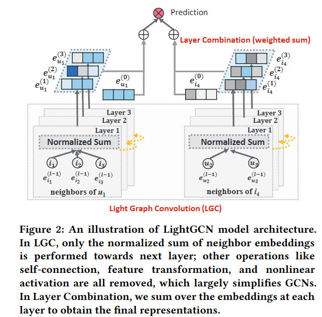

# LightGCN Recommendation System

This is a modified PyTorch implementation of LightGCN (Light Graph Convolutional Network) for recommendation systems, based on the SIGIR 2020 paper:

> Xiangnan He, Kuan Deng, Xiang Wang, Yan Li, Yongdong Zhang, Meng Wang (2020). LightGCN: Simplifying and Powering Graph Convolution Network for Recommendation, [Paper in arXiv](https://arxiv.org/abs/2002.02126).

**Original implementation**: [LightGCN-PyTorch](https://github.com/gusye1234/LightGCN-PyTorch) by the paper authors.

## Modifications for Kaggle Competition

This version has been adapted specifically for the Recommendation Systems Kaggle competition. The key modifications include:

- Optimized memory management for larger datasets
- Enhanced configuration system for easier hyperparameter tuning
- Improved batching for more efficient training
- Added evaluation metrics for the competition (HitRate@K)
- Restructured the code for better modularity and readability
- Optimized data loading for competition-specific data format

## Overview

LightGCN is a simplified graph convolutional network designed specifically for recommendation systems. Unlike traditional GCNs, LightGCN includes only the most essential component—neighborhood aggregation—for collaborative filtering, making it more efficient and effective for recommendation tasks.

Key advantages of LightGCN:
- **Simplified Architecture**: Removes feature transformation and nonlinear activation
- **Improved Performance**: Achieves better results with fewer parameters
- **Layer Combination**: Uses weighted layer combination for final embeddings
- **Memory Efficiency**: Requires less memory than standard GCN models

## Model Architecture

LightGCN follows this architecture:
1. **Embedding Layer**: Initializes user and item embeddings
2. **Light Graph Convolution Layers**: Performs weighted sum aggregation of neighbor embeddings
3. **Layer Combination**: Combines embeddings from all layers
4. **Prediction Layer**: Calculates user-item affinity using inner product



The core equation of LightGCN is:

```
e_u^(k+1) = ∑_(i∈N_u) 1/√(|N_u|) · 1/√(|N_i|) · e_i^(k)
```

Where:
- e_u^(k) is the embedding of user u at layer k
- N_u is the set of items that user u has interacted with
- N_i is the set of users that have interacted with item i

## Project Structure

```
LightGCN/
├── README.md                # Project documentation
├── requirements.txt         # Dependencies
├── hitrate.py               # Evaluation metrics
├── code/                    # Source code
│   ├── main.py              # Entry point
│   ├── model.py             # LightGCN model implementation
│   ├── dataloader.py        # Data loading and processing
│   ├── Procedure.py         # Training and testing procedures
│   ├── world.py             # Global configuration
│   ├── utils.py             # Utility functions
│   ├── register.py          # Registry for models and datasets
│   ├── parse.py             # Command-line argument parsing
│   └── sources/             # C++ extensions
│       └── sampling.cpp     # Efficient negative sampling
├── docs/                    # Additional documentation
│   ├── architecture.md      # Detailed architecture explanation
└── imgs/                    # Images for documentation
    ├── tf.jpg
    └── torch.png
```

## Requirements

Install dependencies:

```bash
pip install -r requirements.txt
```

Key dependencies:
- PyTorch >= 1.6.0
- NumPy
- SciPy
- TensorboardX
- pybind11 (for C++ extension)
- cppimport (for C++ extension)

## How to Use

As per the Kaggle competition data sharing policy, we cannot share the dataset. So, this project is not open source in a way that people might not be able to run the code. However, they can see the code and understand the logic.

### Training

To train a 3-layer LightGCN model:

```bash
cd code
python main.py --decay=1e-4 --lr=0.001 --layer=3 --seed=2020 --dataset="kaggle" --topks="[10]" --recdim=64
```

Parameters:
- `--decay`: Weight decay (L2 regularization)
- `--lr`: Learning rate
- `--layer`: Number of graph convolution layers
- `--seed`: Random seed for reproducibility
- `--dataset`: Dataset name
- `--topks`: Evaluation k values
- `--recdim`: Dimension of embeddings

### Evaluation

Evaluation metrics include:
- Precision@K
- Recall@K
- NDCG@K
- HitRate@K

The model is evaluated during training and after completion.

## Results

Please see the [Report](Report/MLDM_Project_Report.pdf) for detailed results and analysis.


## Citation

If you use this code for your research, please cite the original paper:

```
@inproceedings{he2020lightgcn,
  title={LightGCN: Simplifying and Powering Graph Convolution Network for Recommendation},
  author={He, Xiangnan and Deng, Kuan and Wang, Xiang and Li, Yan and Zhang, Yongdong and Wang, Meng},
  booktitle={Proceedings of the 43rd International ACM SIGIR Conference on Research and Development in Information Retrieval},
  pages={639--648},
  year={2020}
}
```

## Acknowledgments

This implementation is based on the original [LightGCN-PyTorch](https://github.com/gusye1234/LightGCN-PyTorch) repository by the authors of the LightGCN paper. We have modified it for the Kaggle Recommendation System competition with optimizations for memory efficiency, faster training, and competition-specific metrics.
