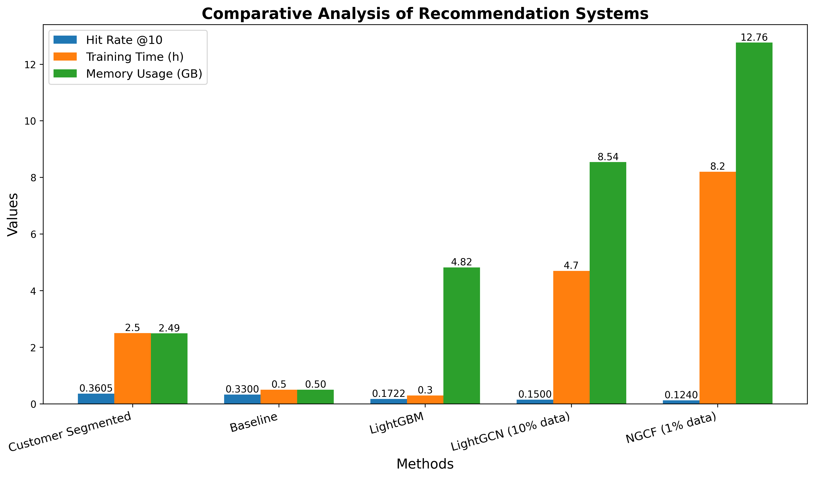

# Recommendation System for Carrefour eCommerce (Kaggle Competition)

This repository documents our comprehensive approach to building an effective recommendation system for predicting customer repurchases on Carrefour's eCommerce platform. Starting with simple statistical methods and progressing to advanced neural network architectures, we've explored multiple approaches to tackle this recommendation challenge.

## Project Structure

This project is organized into four main approaches:

1. **Statistical Approaches** - Baseline and hybrid models using frequency, recency, and customer segmentation
2. **Neural Graph Collaborative Filtering (NGCF)** - Graph-based recommendation using high-order connectivity
3. **LightGCN** - A lightweight graph convolution network for recommendation
4. **LightGBM** - Gradient boosting framework for recommendation as classification

## 1. Statistical Approaches

We began with simple but effective statistical methods:

- **Global Popularity** - Ranking based on purchase frequency across all customers
- **Recency-Based** - Products purchased in recent transactions
- **Time-Weighted Frequency** - Exponentially down-weighting older purchases
- **Hybrid Models** - Combining recency, frequency, and seasonality
- **Customer Segmentation** - Different recommendation strategies for user segments

Our customer segmentation approach, which divided users into high-, medium-, and low-frequency tiers with different weight distributions, achieved a Hitrate@10 of 0.36, significantly outperforming the baseline (0.33).

### Key Features
- Memory-efficient data processing
- Multiple recommendation strategies
- Comprehensive evaluation metrics
- No training required - fast deployment

[See Statistical Approaches Documentation](./1_Statistical_Approches/README.md)

## 2. Neural Graph Collaborative Filtering (NGCF)

NGCF constructs a bipartite graph between users and items, refining embeddings through multi-layer propagation:

- Captures high-order connectivity patterns
- Sophisticated negative sampling to address class imbalance
- GPU-accelerated computation

Due to computational constraints, NGCF was implemented with just 1% of the dataset, achieving a Hitrate@10 of 0.124.

[See NGCF Documentation](./2_NGCF/README.md)

## 3. LightGCN

LightGCN is a simplified version of graph convolution networks designed specifically for recommendation:

- Removes feature transformation and non-linear activation
- Focuses on essential neighborhood aggregation
- More efficient training than NGCF
- Layer combination mechanism for final embeddings

Our LightGCN implementation was trained on 10% of the dataset and achieved a Hitrate@10 of 0.15.

[See LightGCN Documentation](./3_LightGCN/README.md)

## 4. LightGBM

We approached recommendation as a classification problem using LightGBM:

- Feature engineering from user-item interactions
- Negative sampling for balanced training
- Gradient boosting for effective classification
- Fast training and inference

LightGBM achieved a Hitrate@10 of 0.1722, despite processing the complete dataset, indicating that efficient processing alone does not guarantee better predictions in the grocery domain.

[See LightGBM Documentation](./4_LightGBM/README.md)

## Comparative Analysis

Our comprehensive evaluation revealed key strengths and weaknesses across approaches:

| Method | Hitrate@10 | Training Time (hours) | Memory Usage (GB) | Key Advantage |
|--------|------------|----------------------|--------------------|---------------|
| Customer Segmented | 0.3605 | 2.5 | 2.49 | Best overall performance |
| Baseline | 0.3300 | - | 0.5 | Simple implementation |
| LightGBM | 0.1722 | 0.3 | 4.82 | Fast training |
| LightGCN (10% data) | 0.1500 | 4.7 | 8.54 | Efficient graph learning |
| NGCF (1% data) | 0.1240 | 8.2 | 12.76 | High-order connectivity |

The statistical customer segmentation approach showed the best overall performance, surpassing the baseline score of 0.33. This success stems from its effective combination of frequency and recency signals, weighted differently across customer segments. The method's ability to adapt to varying purchase patterns proved crucial in the grocery e-commerce context, where product repurchase intervals show high variability.

The deep learning approaches, despite their sophisticated architectures, showed lower performance when compared to both the baseline and statistical methods. LightGCN, trained on 10% of the dataset, achieved 0.15, while NGCF, implemented with just 1% of customers, reached 0.124. These results suggest that in this grocery domain, the complexity of neural architectures may not inherently guarantee better recommendations, especially with limited data.

Similarly, LightGBM recorded a Hitrate@10 of 0.1722, failing to surpass the baseline level of 0.33. While LightGBM is generally efficient, the features that were engineered did not sufficiently capture the intricate relationships between customers and products in the grocery setting.

## Conclusion

The implementation and evaluation of multiple recommendation approaches for Carrefour's e-commerce platform revealed several critical insights about the grocery e-commerce domain:

1. **Domain-Specific Characteristics Matter**: The relatively low Hit Rate @10 scores across all methods (best performing at 0.3605) indicate the fundamental challenge of predicting grocery repurchases.

2. **Complexity vs. Performance**: The superior performance of statistical approaches over neural methods raises important questions about the role of model complexity in recommendation systems. Despite the theoretical advantages of NGCF and LightGCN in capturing high-order relationships, their lower performance on partial datasets suggests that additional complexity might not translate to better predictions in the grocery domain.

3. **Data Sampling Limitations**: A significant limitation of our work lies in the data sampling for neural approaches, where computational constraints restricted NGCF to 1% and LightGCN to 10% of the dataset, making direct comparison challenging.

4. **Transaction Patterns**: The discovered transaction patterns - highly variable purchase frequencies and small basket sizes - suggest that future work should focus more on understanding and incorporating these domain-specific characteristics rather than increasing model complexity.

These findings emphasize that domain-aware statistical methods can outperform more complex approaches in certain contexts. The strength of the customer-segmented model illustrates the importance of understanding purchasing frequencies and adapting to varying repurchase patterns.

## Data Note

Due to competition policies, we cannot share the original data. This project is provided for educational purposes to demonstrate different recommendation system approaches and implementation techniques.

## References

- Wang, Xiang, et al. "Neural graph collaborative filtering." *SIGIR* (2019)
- He, Xiangnan, et al. "LightGCN: Simplifying and Powering Graph Convolution Network for Recommendation." *SIGIR* (2020)
- Ke, Guolin, et al. "LightGBM: A Highly Efficient Gradient Boosting Decision Tree." *NIPS* (2017)
- Smirnov, N. "Table for estimating the goodness of fit of empirical distributions." *The Annals of Mathematical Statistics* (1948)

## Project Documents

- [Full Technical Report](./Report/MLDM_Project_Report.pdf)
- [Presentation](./Presentation/Recommendation_systems_Kaggle.pdf)